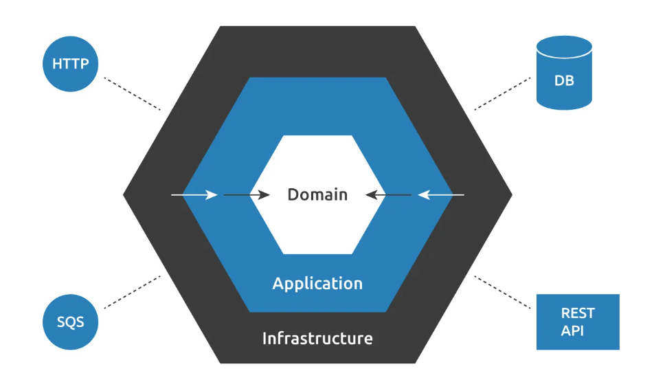

# sport-store : backend

✅ You're tasked with building a website that allows Marcus, a bicycle shop owner, to sell his bicycles.  Marcus owns a growing business and now wants to sell online. 

## Domain
✅ **_PRODUCT_**: He also tells you that bicycles are his main **`product`**, but if the business continues to grow, he will surely start selling other sports-related items such as skis, surfboards, roller skates, etc. It would be a nice bonus if the same website allowed him to sell those things as well.

✅ **_PARTS_**: What makes Marcus's business successful is that customers can fully customize their bicycles. They can select many different options for the various **`parts`** of the bicycle.

✅ **_PART CHOICES_**: Here is an incomplete list of all the parts and their **`possible choices`**, to give an example:
* Frame type: Full-suspension, diamond, step-through
* Frame finish: Matte, shiny
* Wheels: Road wheels, mountain wheels, fat bike wheels
* Rim color: Red, black, blue
* Chain: Single-speed chain, 8-speed chain

## Business rules

**_PRODUCT SERVICE: COMBINATION_** 

❌ On top of that, Marcus points out that some combinations are prohibited because they are not possible in reality. For example:
* If you select "mountain wheels," then the only frame available is the full-suspension.
* If you select "fat bike wheels," then the red rim color is unavailable because the **`manufacturer`** doesn't provide it.

**_INVENTORY SERVICE: STOCK VALIDATION_**

❌ Additionally, Marcus sometimes doesn't have all possible variations of each part in **`stock`**, so he wants to be able to mark them as "temporarily out of stock" to avoid receiving orders he can't fulfill.

**_PRICE CALCULATION SERVICE_**

✅ Finally, Marcus explains how to calculate the price that you should present to the customer after customizing a bicycle. Normally, this price is calculated by adding up the individual prices of each selected part. For example:
* Full suspension = 130 EUR
* Shiny frame = 30 EUR
* Road wheels = 80 EUR
* Rim color blue = 20 EUR
* Chain: Single-speed chain = 43 EUR
* **_Total price: 130 + 30 + 80 + 20 + 43 = 303 EUR_**

❌ However, the price of some options might depend on others. For instance, the frame finish is applied over the whole bicycle, so the more area to cover, the more expensive it gets. Because of that, the matte finish over a full-suspension frame costs 50 EUR, while applied over a diamond frame it costs 35 EUR. These kinds of variations can always happen, and they might depend on any of the other choices, so Marcus asks you to consider this, as otherwise, he would be losing money.

### Code Exercise Overview: 

This code exercise consists of defining a software architecture that could satisfy the requirements described above. In particular:

* ✅ **_Data model_**: What data model would best support this application? Can you describe it? Include table specifications (or documents if it's a non-relational database) with fields, their associations, and the meaning of each entity.
* ✅ **_Main user actions_**: Explain the main actions users would take on this e-commerce website in detail.
* 🟡 **_Product page_**: This is a read operation, performed when displaying a product page for the customer to purchase. How would you present this UI? How would you calculate which options are available? How would you calculate the price depending on the customer's selections?
* 🟡 **_Add to cart action_**: Once the customer makes their selection, there should be an "add to cart" button. What happens when the customer clicks this button? What is persisted in the database?
* ❌ **_Administrative workflows_**: Describe the main workflows for Marcus to manage his store.
* 🟡 **_New product creation_**: What information is required to create a new product? How does the database change?
* ✅ **_Adding a new part choice_**: How can Marcus introduce a new rim color? Describe the UI and how the database changes.
* ❌ **_Setting prices_**: How can Marcus change the price of a specific part or specify particular pricing for combinations of choices? How does the UI and database handle this?

✅ We expect you to provide the core model of the solution: a set of classes/functions/modules in the language of your choice that describe the main relationships between entities, along with any supporting materials (database schemas, diagrams, etc.). 

✅ Please keep it lightweight—no need to use web frameworks or provide a finished solution. 

✅ For any other system specifications not directly stated in the exercise, feel free to interpret them as you see fit.

---

### Hexagonal Architecture

I've decided to use Hexagonal Architecture to keep the project clean and modular. This approach helps ensure each component has a single responsibility and can evolve independently.

---

##### Run server with:

`mvn spring-boot:run`

or

`mvn clean package`

`java -jar .\target\backend-1.0.jar`

Database H2 Console:

http://localhost:8080/h2-console

---

##### Call the API like:

**Products:**

Product list:

`curl -X GET http://localhost:8080/api/products`

Product by id:

`curl -X GET http://localhost:8080/api/products/2`